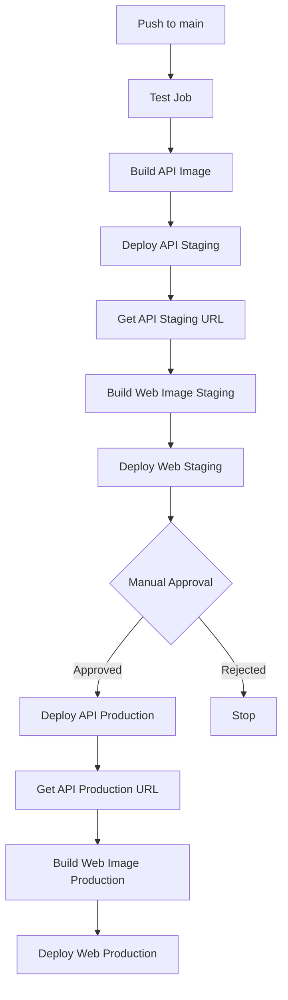

# GitHub Actions CI/CD Guide

## Overview

This project uses GitHub Actions for automated testing, building, and deployment to Google Cloud Platform (GCP). The CI/CD pipeline consists of three main workflows:

## Workflows

### 1. **CI/CD Pipeline** (`.github/workflows/ci-cd.yml`)

**Triggers:**
- Push to `main` branch
- Push to `develop` branch (tests only)
- Pull requests to `main` or `develop`

**Jobs:**

#### Test Job
Runs on every push and PR:
- ✅ TypeScript type checking
- ✅ ESLint code linting
- ✅ Full test suite (151 tests)
- ✅ Test summary output

#### Build API Job
Runs only on `main` branch pushes:
- 🐳 Builds API Docker image
- 📦 Pushes to GCP Artifact Registry
- 🏷️ Tags with Git SHA (short) and `latest`

**Why only API?** Web images are built **per environment** during deployment to ensure correct API URLs are baked in at build time.

#### Deploy Staging Job
Runs after API build on `main` branch:
1. Deploys API to Cloud Run (`api-staging`)
2. Gets the deployed API URL
3. **Builds staging web image** with staging API URL
4. Pushes web image to Artifact Registry (tagged with `-staging` suffix)
5. Deploys web to Cloud Run (`web-staging`)
6. Outputs deployed URLs

**Environment:** `staging` (no manual approval required)

#### Deploy Production Job
Runs after staging deployment on `main` branch:
1. Deploys API to Cloud Run (`api`)
2. Gets the deployed API URL
3. **Builds production web image** with production API URL
4. Pushes web image to Artifact Registry (tagged with SHA and `latest`)
5. Deploys web to Cloud Run (`web`)
6. Outputs deployed URLs

**Environment:** `production` (requires manual approval in GitHub)

### 2. **PR Checks** (`.github/workflows/pr-checks.yml`)

**Triggers:**
- Pull requests to `develop` or `main`

**Jobs:**

#### Validate PR
- TypeScript type checking
- ESLint linting
- Full test suite with coverage
- Code quality checks (TODO/FIXME count)
- Bundle size analysis
- PR summary output

#### Docker Build Test
- Tests API Docker build
- Tests Web Docker build
- Ensures Dockerfiles are valid

**Purpose:** Fast feedback on PRs without deploying anything.

## Required GitHub Secrets

Configure these in **Settings → Secrets and variables → Actions**:

| Secret Name | Description | Example |
|---|---|---|
| `GCP_PROJECT_ID` | Your GCP project ID | `my-project-123` |
| `GCP_SA_KEY` | Service account JSON key | `{ "type": "service_account", ... }` |

**Note:** API/Web URLs are determined dynamically during deployment, so no need to configure them as secrets.

## Environment Variables

Set these in GCP Secret Manager (handled by `setup-gcp.sh`):

- `CT_PROJECT_KEY` — commercetools project key
- `CT_CLIENT_ID` — commercetools client ID
- `CT_CLIENT_SECRET` — commercetools client secret
- `CT_AUTH_URL` — commercetools auth URL
- `CT_API_URL` — commercetools API URL
- `CT_SCOPES` — commercetools API scopes
- `REDIS_URL_STAGING` — Redis connection string for staging
- `REDIS_URL_PROD` — Redis connection string for production

## Workflow Triggers

### Automatic Deployments
```bash
# Deploy to staging automatically
git checkout main
git merge develop
git push origin main
# ↑ This triggers: test → build-api → deploy-staging → deploy-production
```

### Manual Approval for Production
After staging deploys successfully, production deployment will wait for manual approval:
1. Go to **Actions** tab in GitHub
2. Click on the running workflow
3. Click **Review deployments**
4. Select **production** environment
5. Click **Approve and deploy**

### Skipping Deployments
To push to `main` without deploying, add `[skip ci]` to your commit message:
```bash
git commit -m "docs: update README [skip ci]"
```

## Monitoring Deployments

### View Workflow Runs
- Go to **Actions** tab in GitHub
- Click on a workflow run to see details
- Each job shows real-time logs and summaries

### View Deployment Logs
```bash
# Staging logs
gcloud run services logs read api-staging --region=us-central1
gcloud run services logs read web-staging --region=us-central1

# Production logs
gcloud run services logs read api --region=us-central1
gcloud run services logs read web --region=us-central1
```

### View Deployed Services
```bash
# List all Cloud Run services
gcloud run services list --region=us-central1

# Get service details
gcloud run services describe api-staging --region=us-central1
gcloud run services describe web-staging --region=us-central1
```

## Deployment Architecture



## Key Features

### 🎯 Environment-Specific Web Builds
Web images are built **per environment** to ensure:
- Staging web app connects to staging API
- Production web app connects to production API
- No hardcoded URLs or placeholders
- Build-time baking of `NEXT_PUBLIC_API_URL`

### 🔒 Manual Production Approval
Production deployments require manual approval before proceeding, ensuring:
- Staging is tested first
- Human verification before production changes
- Compliance with change management policies

### 📊 Rich Summaries
Each job outputs detailed summaries:
- Test results
- Build artifacts
- Deployment URLs
- Version information

### 🚀 Fast Feedback
- PR checks run in parallel with Docker build tests
- Caching of npm dependencies speeds up builds
- Early failure stops subsequent jobs

## Troubleshooting

### "No secrets found" Error
Ensure secrets are added to GitHub repository:
```bash
# Verify secrets are set
gh secret list
```

### Docker Build Failures
Check Dockerfile syntax and dependencies:
```bash
# Test locally
docker build -f apps/api/Dockerfile -t test-api .
docker build -f apps/web/Dockerfile -t test-web \
  --build-arg NEXT_PUBLIC_API_URL=http://localhost:8080 .
```

### Cloud Run Deployment Failures
Check GCP service account permissions:
```bash
# List service account roles
gcloud projects get-iam-policy $GCP_PROJECT_ID \
  --flatten="bindings[].members" \
  --filter="bindings.members:github-actions@*"
```

### Web App Shows 404 or API Errors
Verify `NEXT_PUBLIC_API_URL` was set correctly:
1. Check Cloud Run web service environment variables
2. Verify API URL was fetched before web build
3. Check browser console for network errors

## Manual Deployment (Without CI/CD)

If you need to deploy manually:
```bash
export GCP_PROJECT_ID=your-project-id
./scripts/deploy-to-gcp.sh staging   # Deploy to staging
./scripts/deploy-to-gcp.sh production  # Deploy to production
```

See [DEPLOYMENT_GUIDE.md](../docs/DEPLOYMENT_GUIDE.md) for detailed manual deployment instructions.

## Adding New Environments

To add a new environment (e.g., `development`):

1. **Update CI/CD workflow** (`.github/workflows/ci-cd.yml`):
   - Add new `deploy-development` job
   - Set appropriate resource limits
   - Use separate Redis secret (`REDIS_URL_DEVELOPMENT`)

2. **Add GitHub environment**:
   - Go to **Settings → Environments**
   - Click **New environment**
   - Set protection rules if needed

3. **Update deployment script**:
   - Add environment handling to `deploy-to-gcp.sh`
   - Set appropriate service names

4. **Create secrets in GCP**:
   ```bash
   gcloud secrets create REDIS_URL_DEVELOPMENT --data-file=-
   ```

## Best Practices

### ✅ Do
- Always run tests locally before pushing: `npm test`
- Use conventional commits: `feat:`, `fix:`, `chore:`
- Test Docker builds locally before pushing
- Review staging deployment before approving production
- Monitor logs after deployment

### ❌ Don't
- Don't commit directly to `main` (use PRs)
- Don't skip tests with `[skip ci]` unless necessary
- Don't hardcode secrets in code or workflows
- Don't approve production without testing staging
- Don't modify environment variables without documenting

## Related Documentation

- [GCP Deployment Checklist](../GCP_DEPLOYMENT_CHECKLIST.md) — Initial setup guide
- [Deployment Guide](../docs/DEPLOYMENT_GUIDE.md) — Manual deployment instructions
- [Architecture Guide](../docs/ARCHITECTURE_GUIDE.md) — System architecture
- [Testing Guide](../docs/TESTING_GUIDE.md) — Testing strategies

## Support

For issues or questions:
1. Check workflow logs in **Actions** tab
2. Review [Troubleshooting](#troubleshooting) section
3. Check GCP Cloud Run logs
4. Review deployment script output
5. Open an issue in the repository
